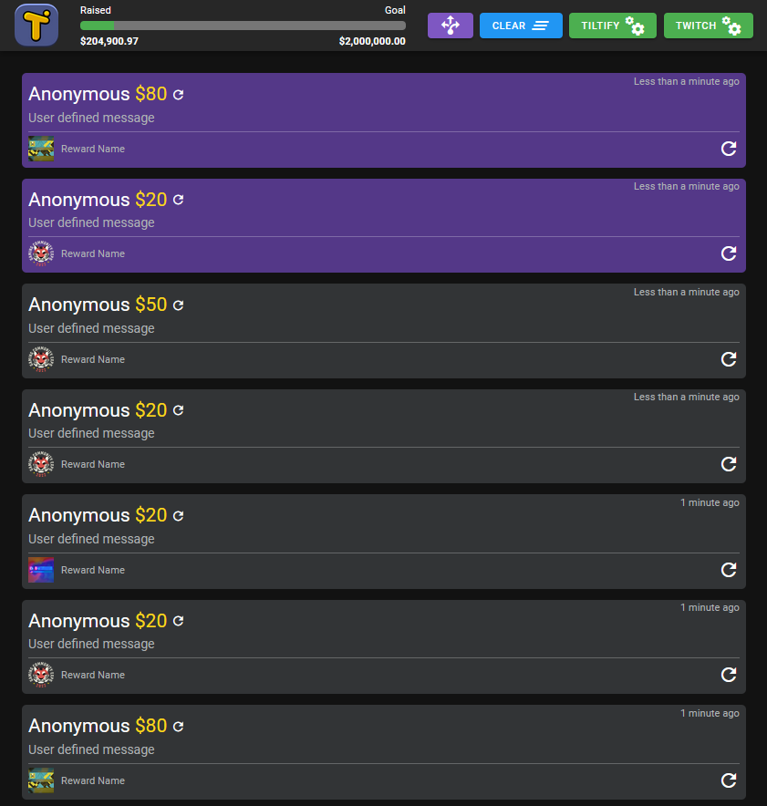

# Tiltify BitBot GUI

#### A standalone desktop webpage to bridge Tiltify and InstructBot(BitBot) by use of Twitch chat. 


## Initial Setup
* Download and extract files.
* Make a copy of the ``config-example.js`` file and rename it ``config.js``.
* Retrieve and enter a Tiltify Access Token and Twitch Chat OAuth Token into the ``config.js`` file.
* Open the ``tiltify.html`` file with a browser. (Tested in Firefox and Chrome)

## How to obtain a Tiltify Access Token
* Navigate to https://app.tiltify.com/developers
* Click on ``Create application +``
* Enter an App name and a Redirect URI of http://localhost and click ``Create App`` at the bottom.
* Find the API access token at the bottom of the page in the ``Application Keys`` section.
* Click to unblur and copy the ``API access token``. This is what you enter in the ``config.js`` file.

## How to obtain a Twitch Chat OAuth Token
* Navigate to https://twitchapps.com/tmi/
* Click the Connect link.
* If redirected to Twitch, click allow access.
* You will then be redirected to the twitchapps website where it will display the oauth token. This is what you need to enter in the ``config.js`` file.

## GUI Settings
The Tiltify and Twitch settings button colors signify the connection status.
* Red -> Disconnected
* Orange -> Connected, but needs further action
* Green -> Connected and Ready

### Misc
* New donations will appear with a purple background.
* Click on the purple donation to "Clear" the donation/background. This will help you keep track of what donations have been acknowledged.
* Click on the blue ``Clear`` icon in the upper right to clear all donations.
* The blue icon with the arrows is used to set a custom BitBot action. Use it for anything you can think of. It will post ``Custom`` in the temp Twitch chat.
* The campaign progress bar will fill with a green color. If the goal is reached or exceeded, it will change to a striped orange color.
* The ``Raised`` and ``Goal`` campaign amounts are updated in realtime.
* Donations/rewards can be replayed by pressing the replay icon. This will resend the message to the temp Twitch chat. 

### Twitch Settings
* Click on the ``Twitch`` settings button in the upper right and enter the Twitch channel you want to send messages to.
  * This is best as a temporary or throwaway channel that other people are not going to notice or see.
* Click connect. Once connected the Twitch settings button will turn green.
* Click the Test button to ensure messages come through to the selected Twitch channel.
* You are able to set an optional prefix that will prepend any messages sent to the temp Twitch chat.
* If using the optional websockets (see below) you can toggle whether other clients are able to send message replays.

### Tiltify Settings
* Click on the ``Tiltify`` settings button in the upper right and enter the Tiltify username for the campaign you want to follow.
  * The Tiltify settings button will turn orange once a connection is made.
  * Once Rewards and/or Incentives are enabled the Tiltify settings button will turn green.
* Past donations will be retrieved from the API if available and fill the page.
* Donation Rewards will be retrieved from the API if available and populate the rewards table.
* Press the Refresh button in the Tiltify settings to reestablish the Tiltify connection and refresh the data from the API.
* Toggle the Purple volume button in the Tiltify settings to mute/unmute the new donation notification sound. (DING)
  * Un-muting the notification will play a test notification.


 * INCENTIVES
    * All donation amounts will be posted to the temp Twitch chat. Example: ``$10``
    * You can set an amount threshold to make a glow appear around certain donation amounts. This is used to make those larger donations stand out of the crowd.
    * Enter an amount and click the ``Test`` button to send the amount to the temp Twitch chat to trigger BitBot.
  * REWARDS
    * If rewards are available they will populate in the table.
    * When somebody claims a reward with a donation it will post the donation ID to the temp Twitch chat prepended with an 'R'. Example: ``R123456``
    * Click the copy icon to copy the Reward ID to your clipboard.
    * Click the play icon to test send the reward to the temp Twitch chat.
    
### Optional Websocket Client Syncing
* Websockets can be used to sync multiple clients as to what donations have been cleared/acknowledged, and even resent events to the temp Twitch chat.
* This way a streamer can work in tandem with a donation reader or other persons, and all are aware what donations have already been read out.
* If you have a Socket.IO websocket 3.x or 4.x server, echo the data from a 'tiltify_clear' and ``tiltify_replay`` message.

Example:
```js
socket.on('tiltify_clear', (data) => {
  socket.broadcast.emit('tiltify_clear', data)
})

socket.on('tiltify_replay', (data) => {
  socket.broadcast.emit('tiltify_replay', data)
})
```
* The websocket URL will need to be added to the ``config.js`` file.
* Ensure that only the MAIN client (streamer) is connected to the temp Twitch chat. Otherwise, donations will be posted multiple times (once from each client).
* The alternate clients can connect to a different Twitch chat if they like.
